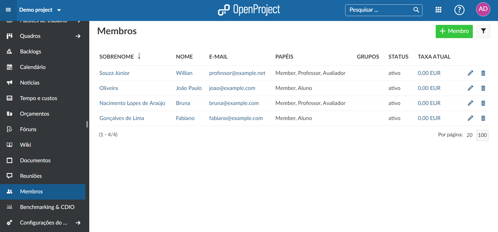
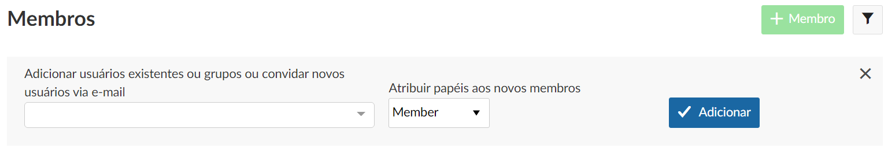
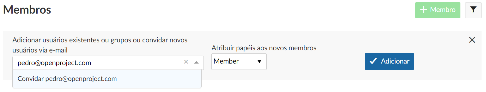

# Convidar membros para o projeto	

Para ver um projeto e trabalhar nele, você precisa ser membro de um projeto. Portanto, você deve **adicionar membros da equipe a um projeto**.

| Tópico                                                       | Conteúdo                                                     |
| ------------------------------------------------------------ | ------------------------------------------------------------ |
| [Ver membros](#ver-membros)                                  | Ver a lista de membros do seu projeto.                       |
| [Adicionar membros existentes](#adicionar-membros-existentes)| Adicionar membros existentes, grupos ou Add existing users, groups or usuarios fixos ao projeto.|
| [Convidar novos membros](#convidar-novos-membros)            | Convidar novos membros para se juntar a um projeto.          |
| [Grupos como membros de projeto](#grupos-como-membros-de-projeto) | Entender os efeitos de adicionar grupos como membros do projeto.  |
| [Usuários fixos como membros de projeto](#usuários-fixos-como-membros-de-projeto) | Entender como diferenciar entre usuários comuns e usuários fixos. |

<video src="https://www.openproject.org/wp-content/uploads/2020/12/OpenProject-Invite-and-Manage-Members.mp4" type="video/mp4" controls="" style="width:100%"></video> **baixar video**

## Ver membros

Para visualizar a lista de **todos os membros do projeto e suas funções** no projeto, selecione Membros no menu do projeto.

## Adicionar membros existentes

Para adicionar usuários existentes, usuários fixos ou grupos a um projeto, selecione o projeto para o qual deseja adicionar membros. No menu de projetos à esquerda, selecione o módulo **Membros**.

Na lista de membros você terá uma visão geral dos membros atuais deste projeto.

Clique no botão verde **+ Membro** no canto superior direito.

Digite o nome do usuário, usuário fixo ou grupo que deseja adicionar. Você também pode escolher vários membros de uma vez. **Atribua uma função** ao(s) novo(s) membr (s) e clique no botão azul **Adicionar**.

Observe que você terá que clicar no nome do novo membro ou pressionar a tecla **Enter** antes de clicar no botão **Adicionar**.

## Convidar novos membros

Você também pode convidar usuários que ainda não possuem uma conta OpenProject. Selecione o projeto para o qual deseja adicionar membros. No menu de projetos à esquerda, selecione o módulo **Membros**.

Digite o endereço de e-mail do membro novo. Se o OpenProject não encontrar um usuário existente, pois as informações de **Convidar** serão colocadas automaticamente antes do endereço de e-mail. Pressione a tecla **Enter** ou selecione o texto **"Convidar..."**. Atribua uma função a este membro novo e clique no botão azul **Adicionar**.

Um convite por e-mail será enviado ao usuário com um link para criar uma conta no OpenProject.

Agora você pode colaborar com sua equipe no OpenProject. Os usuários recém-convidados serão mostrados com um símbolo de letra ao lado de seus nomes.

Observe que a remoção de um membro que ainda não aceitou o convite de um projeto resultará na exclusão desse usuário, o que não pode ser revertido.

## Grupos como membros de projeto

Os grupos têm o seguinte impacto na lista de membros de um projeto e se comportam um pouco diferente dos usuários individuais:

- o grupo é mostrado como uma linha separada na lista de membros do projeto
- os membros do grupo não podem ser removidos da lista de membros individualmente
- adicionar um grupo com membros que já estão em uma lista de membros do projeto adicionará a função do grupo às suas funções de projeto (dos membros)
- um membro do projeto pertencente a um grupo pode ter funções adicionais adicionadas individualmente
- a função do grupo não pode ser alterada para membros individuais do grupo
- 
## Usuários fixos como membros de projeto

Os usuários de espaço reservado têm o seguinte impacto na lista de membros de um projeto e se comportam de maneira um pouco diferente dos usuários normais:

- será mostrado sem endereço de e-mail
- não pode fazer parte de um grupo
