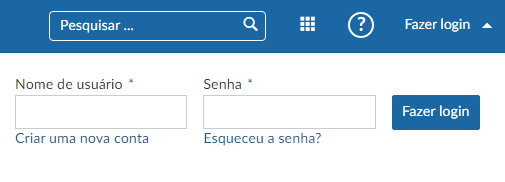

# Login e autenticação

Aqui veremos como entrar e se autenticar no OpenProject.

| Tópico                                                       | Conteúdo                                                     |
| ------------------------------------------------------------ | ------------------------------------------------------------ |
| [Logar com a conta institucional](#login-via-conta-institucional) | Logar com uma conta institucional já eistente.          |
| [Criar uma nova conta (via OpenProject)](#criar-nova-conta-via-openproject)  | Criar uma nova conta.                        |
| [Resetar a senha](#resetar-a-senha)                          | Como resetar a senha.                                        |

## Login via conta institucional

O nosso projeto utilizando o OpenProject já possui integração e autenticação direta com os dados institucionais, portanto, para fazer o login, digite seu usuário e senha que você usa para acessar o SIGAA o/ou MOODLE, assim seu nome de usuário e e-mail já estarão configurados para utilizar a plataforma, fazer postagens, requisições, entrar em grupos de trabalho e ser avaliados sem nenhuma ativação via link externo.

## Criar nova conta via OpenProject

É possivel criar uma conta através da plataforma.

## Resetar a senha

Como o login está totalmente dependente da conta institucional, para resetar a senha será preciso fazer isso diretamente com a instituição, seja ela qual for.
