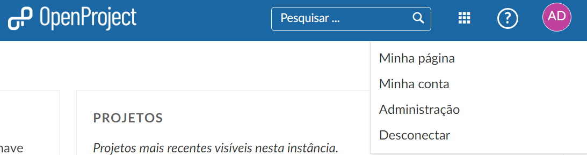
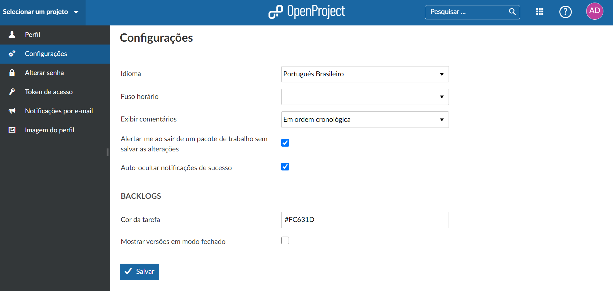
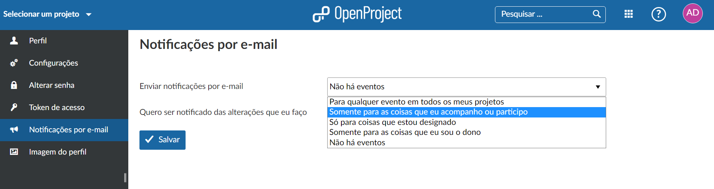
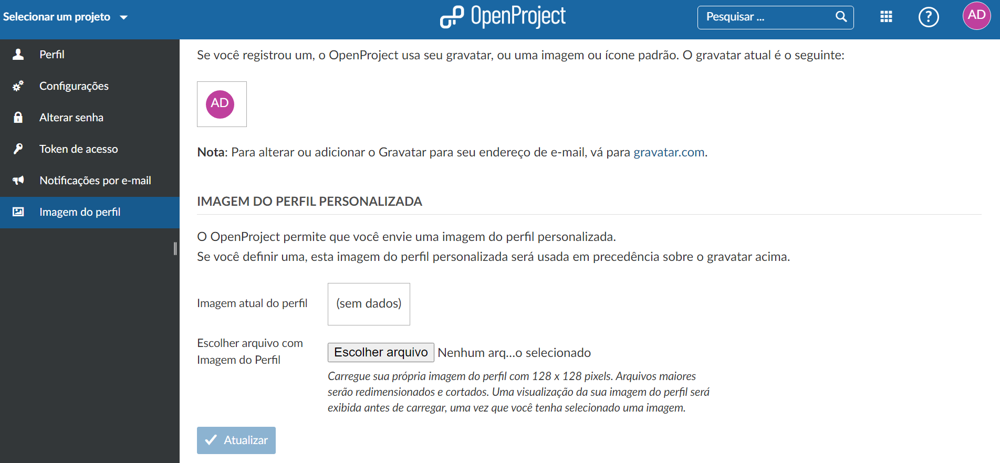

# Minha conta

Altere suas configurações pessoais em Minha conta. Aqui você poder, por exemplo, trocar o idioma, editar notificações, adicionar imagens de perfil entre outras coisas.

| Tópico                                                       | Conteúdo                                                     |
| ------------------------------------------------------------ | ------------------------------------------------------------ |
| [Abrir configurações da Minha conta](#Abrir-configurações-da-minha-conta) | Abrir suas configurações pessoais no OpenProject|
| [Editar informações pessoais](#Editar-informações-pessoais)  | Alterar o nome ou endereço de e-mail no OpenProject          |
| [Configurações do perfil](#Configurações-do-perfil)          | Alterar configurações básicas do perfil                      |
| [Notificações por Email](#Notificações-por-Email)            | Alterar notificações de email enviadas pelo OpenProject      |
| [Foto de perfil](#Foto-de-perfil)                            | Definir um avatar no OpenProject e alterar a imagem do perfil|
| [Alterar senha e Token de acesso](#Alterar-senha-e-token-de-acesso) | Observações finais de senha e token de acesso         |

## Abrir configurações da Minha conta

Para abrir suas configurações pessoais no OpenProject, clique no ícone do usuário no canto superior direito do cabeçalho do aplicativo.

Escolha **Minha conta**.

## Editar informações pessoais

Para alterar seu endereço de e-mail ou nome, navegue até a página **Perfil** no menu de configurações da Minha conta.

## Configurações do perfil

Nas configurações de Minha conta, você pode alterar o idioma do OpenProject, mudar o fuso horário, alterar a ordem em que os comentários são exibidos na lista de atividades nos pacotes de trabalho.

Além disso, você pode ativar um alerta para **alertar o usuário ao sair de um pacote de trabalho sem salvar as alterações**.

Além disso, você pode ativar/desativar a opção de **Auto-ocultar notificações de sucesso** do sistema. Isso (apenas) significa que as notificações de sucesso de pop-up verdes serão removidas automaticamente após cinco segundos.

## Notificações por Email

Para configurar as notificações por e-mail que você receberá do sistema, navegue até **Minha conta** e escolha **Notificações por e-mail** no menu.

Você pode escolher entre várias notificações por e-mail.

**Padrão: enviar notificações por e-mail apenas para coisas que eu visualizei ou nas quais estou envolvido.**

Você pode optar por receber e-mails para quaisquer eventos em determinados projetos ou para nenhum evento.

As seguintes opções estão disponíveis para as notificações por e-mail (variando desde o recebimento de e-mails em vários eventos até o recebimento de nenhum e-mail):

- **Para qualquer evento em todos os meus projetos** - Ao selecionar esta opção você receberá um e-mail para qualquer ação nos projetos dos quais é membro (independente de estar ou não envolvido nesta ação). Isso pode ser útil para gerentes que desejam estar sempre atualizados sobre todos os desenvolvimentos sem ter que fazer login no OpenProject. Essa configuração normalmente leva ao recebimento de muitos e-mails.
- **Para qualquer evento apenas nos projetos selecionados** - Esta opção permite que você escolha os projetos para os quais receberá todas as atualizações por e-mail. Além disso, você recebe notificações por e-mail de outros projetos sobre atividades que assiste ou nas quais está envolvido (por exemplo, quando você é o autor, cessionário ou responsável por um pacote de trabalho). Isso é útil para gerentes de projeto que precisam ser informados sobre qualquer mudança nos projetos que gerenciam, mas que desejam receber notificações por e-mail de outros projetos apenas se as atividades os afetarem diretamente.
- **Apenas para coisas que vejo ou em que estou envolvido** - Esta é a opção padrão para novos usuários (a menos que configurada de forma diferente). Os usuários com essa configuração recebem e-mails das atividades nas quais estão envolvidos (por exemplo, se assistirem a uma atividade, forem o autor, cessionário ou responsável). Essa opção geralmente é a melhor opção, pois os usuários só recebem atualizações por email sobre as atividades nas quais estão envolvidos, reduzindo, portanto, o número de emails que recebem.
- **Apenas para as coisas às quais estou atribuído** - Com esta configuração de e-mail, você só recebe atualizações por e-mail das atividades às quais está atribuído (por exemplo, pacotes de trabalho). Isso é útil para usuários que desejam ser notificados por e-mail apenas se estiverem trabalhando ativamente em uma tarefa, e não se forem responsáveis ou observando a atividade.
- **Apenas para coisas das quais eu seja o proprietário** - Quando você seleciona esta configuração, você só recebe atualizações por e-mail para atividades que você criou (por exemplo, pacotes de trabalho, páginas wiki). Isso faz sentido se você não estiver ativamente envolvido em um projeto, mas quiser ser notificado apenas se suas atividades forem atualizadas.
- **Sem evento** - Com essa configuração, você não recebe nenhum e-mail. Você precisa entrar no OpenProject para verificar o status de suas tarefas. A menos que você verifique o status no OpenProject com muita frequência ou não esteja ativamente envolvido em nenhum projeto, essa configuração é geralmente muito restritiva.

Por padrão, você não recebe notificações por e-mail sobre suas próprias alterações. Se você deseja receber e-mails sobre suas próprias alterações (por exemplo, para certificar-se de que os e-mails das alterações feitas por você foram enviados), marque a caixa de seleção **Desejo ser notificado sobre as alterações que eu mesmo fizer**.

## Foto de perfil

Por padrão, a imagem de perfil estará vínculada com a imagem do sistema educacional que faz parte.

Para alterar sua imagem de perfil no OpenProject, você pode definir uma imagem nas configurações de Minha conta. Navegue até **Imagem do perfil** no menu.

O OpenProject usa suas iniciais como imagem de perfil padrão.

Além disso, você pode adicionr uma foto pessoal, selecione a imagem no seu computador e pressione o botão azul **Atualizar** para alterar sua imagem de perfil.

# Alterar senha e Token de acesso

Por padrão essas duas opções não precisam de configuração, visto que a senha é a mesma da instituição que o usuário pertence, então a troca de senha apenas poderá ser feita no site da instituição.
