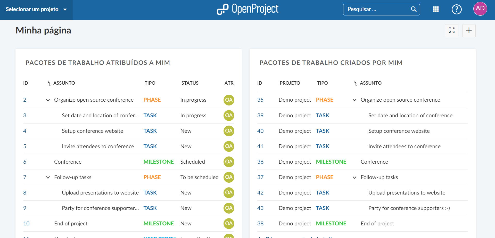

# Minha Página

Minha página é o seu ** painel pessoal ** com importantes informações gerais do projeto, como relatórios de pacotes de trabalho, notícias, tempo gasto ou um calendário. Ele pode ser configurado de acordo com suas necessidades específicas.

| Tópico                                          | Conteúdo                                   |
| ----------------------------------------------- | ------------------------------------------ |
| [Introdução à Minha Página](#introdução-à-minha-página) | O que é minha página e o que posso fazer com ela? |
| [Configurar a Minha página](#configurar-a-minha-página)   | Como adicionar e editar widgets na minha página?  |
| [Widget de meu tempo gasto](#widget-de-meu-tempo-gasto) | Como controlar o tempo gasto em minha página?     |

## Introdução à minha página

**Minha página** é o seu painel pessoal onde você pode exibir informações importantes de seus projetos. Este painel pessoal contém informações de todos os seus projetos.**Minha página** pode ser configurada de acordo com suas preferências. Você pode incluir informações do projeto, por exemplo, as últimas notícias, pacotes de trabalho atribuídos a você ou pacotes de trabalho relatados.

Você pode abrir sua **Minha página** clicando em seu ícone de usuário no canto superior direito e selecionando **Minha página** no menu suspenso.

Como padrão, você verá duas listas de todos os **pacotes de trabalho atribuídos a você** e **pacotes de trabalho criados por você** a partir de todos os seus projetos.

## Configurar a Minha Página

### Adicionar widgets

Para **adicionar um widget à Minha Página**, pressione o ícone **+** no canto superior direito da página.

O painel mostra os locais onde é possível adicionar mais widgets exibindo ícones **+**.

Pressione um ícone de adição para adicionar um widget a Minha Página no local adequado.

Depois de escolher o local onde adicionar o novo widget em Minha página, você pode escolher entre vários widgets diferentes que podem ser incluídos em seu painel.

Para uma **explicação detalhada dos widgets**, fique a vontade para adiciona-los e testa-los.

### Mudar a posição dos widgets

Você pode alterar a posição de um widget no painel arrastando e soltando.

Clique nos pontos ao lado do título e arraste-o para o novo local.

### Alterar o tamanho de um widget

Se você clicar nos pontos no canto inferior direito de um widget, poderá alterar o tamanho de um widget puxando o widget para a esquerda e para a direita, para cima e para baixo com o mouse.

### Configure a visualização de um widget (para tabelas de pacote de trabalho)

Você pode configurar a visualização de um widget de pacote de trabalho para incluir as informações necessárias.

Em um widget de pacote de trabalho, clique nos três pontos e selecione **Configurar visualização ...**

Você pode configurar a tabela de pacotes de trabalho (por exemplo, filtro, grupo, destaque, classificação) de acordo com os critérios de filtro, classificação e agrupamento para pacotes de trabalho.

### Remover um widget

Para excluir um widget do painel, clique nos três pontos no canto superior direito do widget e selecione **Remover widget**.

## Widget de meu tempo gasto

Para controlar o tempo gasto, adicione o widget de **Meu tempo gasto** em Minha página.

Você pode criar diretamente novas entradas de tempo clicando no dia, alterar a data arrastando e soltando, editar ou remover entradas de tempo.
