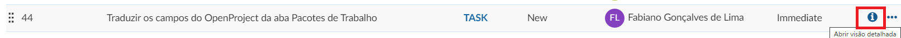

# Introdução aos Pacotes de Trabalho

Neste documento, você obterá uma primeira introdução aos pacotes de trabalho. Você descobrirá como criar e atualizar pacotes de trabalho em um projeto.

Para obter mais documentação, visite nosso [guia do usuário para pacotes de trabalho] (../../ guia do usuário / pacotes de trabalho).

| Tópico                                         | Conteúdo                                       |
| ---------------------------------------------- | ---------------------------------------------- |
| [O que é um pacote de trabalho?](#O-que-é-um-pacote-de-trabalho?) | Descubra o que é um pacote de trabalho no OpenProject. |
| [Criar um novo pacote de trabalho](#Criar-um-novo-pacote-de-trabalho) | Criar um novo pacote de trabalho em um projeto |
| [Abrir e editar um pacote de trabalho](#Abrir-e-editar-um-pacote-de-trabalho) | Abrir e fazer alterações em um pacote de trabalho existente |
| [Atividade dos pacotes de trabalho](#Atividade-dos-pacotes-de-trabalho) | Ver todas as mudanças em um pacote de trabalho. |

## O que é um pacote de trabalho?

Um pacote de trabalho no OpenProject pode ser basicamente tudo que você precisa para manter o controle de seus projetos. Pode ser, por exemplo, uma tarefa, um recurso, um bug, um risco, um marco ou uma fase do projeto. Esses diferentes tipos de pacotes de trabalho são chamados de **tipos de pacotes de trabalho**.

## Criar um novo pacote de trabalho

Para começar, crie um novo pacote de trabalho em seu projeto, abra o projeto com o menu suspenso do projeto, navegue até os **pacotes de trabalho do módulo** no menu do projeto.

No módulo de pacotes de trabalho, clique no botão verde + Criar para criar um novo pacote de trabalho. No menu suspenso, escolha o tipo de pacote de trabalho que deseja criar, por exemplo, uma tarefa ou um marco.

Uma visualização em tela dividida é aberta com o novo formulário de pacote de trabalho à direita e a lista de pacotes de trabalho já existentes à esquerda.

*Se ainda não houver pacotes de trabalho no projeto, você verá uma mensagem de que não há pacotes de trabalho a serem exibidos na lista.*

No formulário vazio à direita, você pode inserir todas as informações relevantes para este pacote de trabalho, por exemplo, o assunto e uma descrição, defina um responsável, uma data de conclusão ou qualquer outro campo. Os campos que você pode preencher são chamados de **atributos do pacote de trabalho**. Além disso, você pode adicionar anexos com copiar e colar ou arrastar e soltar.

Clique no botão **Salvar** azul para criar o pacote de trabalho.

O pacote de trabalho será exibido na visualização de lista:

## Abrir e editar um pacote de trabalho

Para abrir e editar um pacote de trabalho existente da lista, selecione o pacote de trabalho na lista que deseja editar e clique no ícone **abrir visualização de detalhes** na lista de pacotes de trabalho ou no topo da lista para abrir o visualização em tela dividida. Outras maneiras de abri-lo são clicar duas vezes no pacote de trabalho ou clicar no ID do pacote de trabalho.

Clique em qualquer um dos campos para **atualizar um pacote de trabalho**, por exemplo Descrição. Clique na marca de seleção na parte inferior do campo de entrada para salvar as alterações.

Para **atualizar o status**, clique no status exibido destacado na parte superior do formulário e selecione o novo status no menu suspenso.

## Atividade dos pacotes de trabalho

Para se manter informado sobre todas as mudanças em um pacote de trabalho, abra a guia **ATIVIDADE** na visualização de detalhes.

Aqui você verá todas as mudanças que foram feitas neste pacote de trabalho.

Você também pode inserir um comentário no final da lista de atividades.

