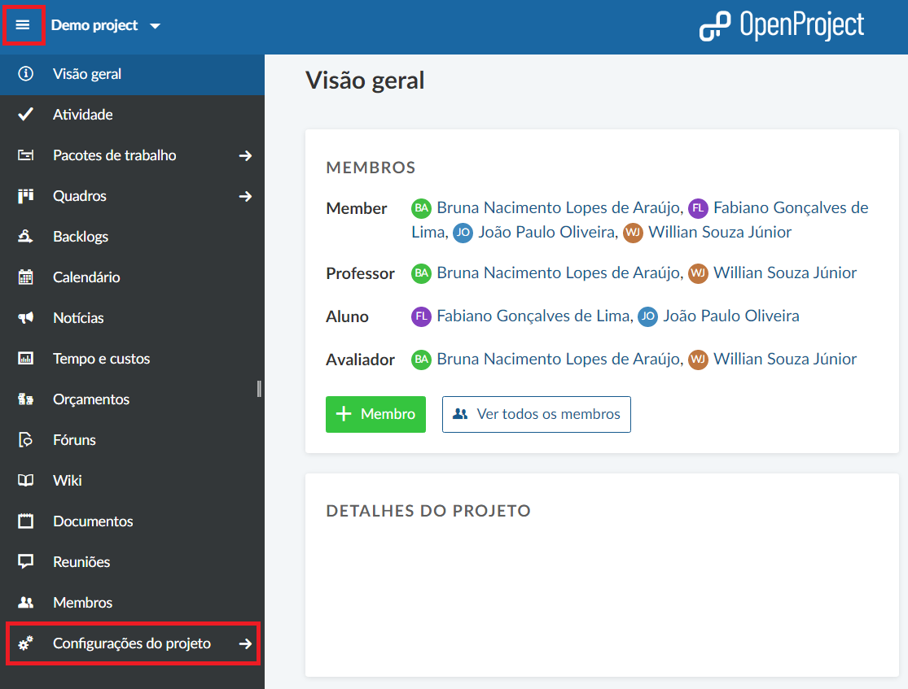
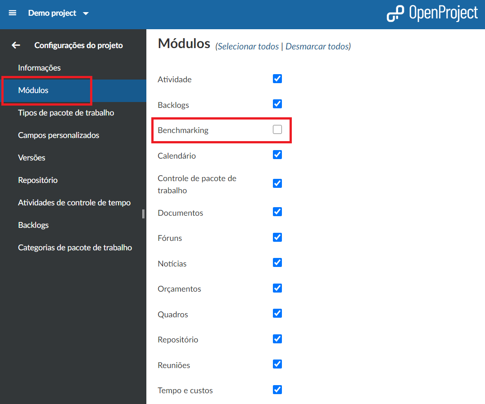
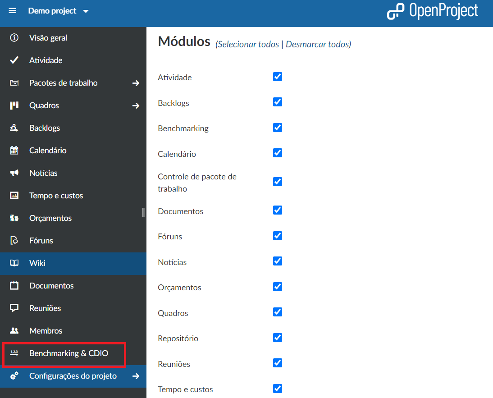
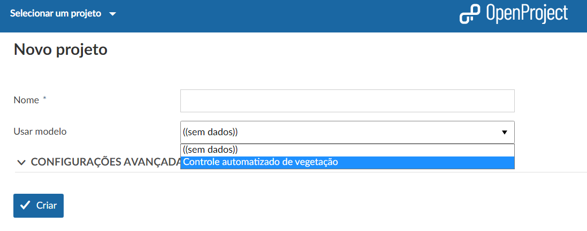
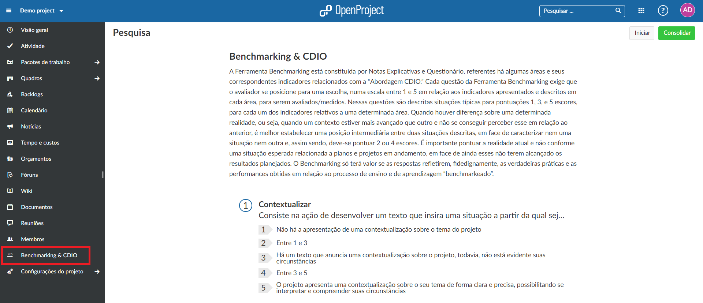
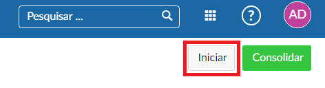
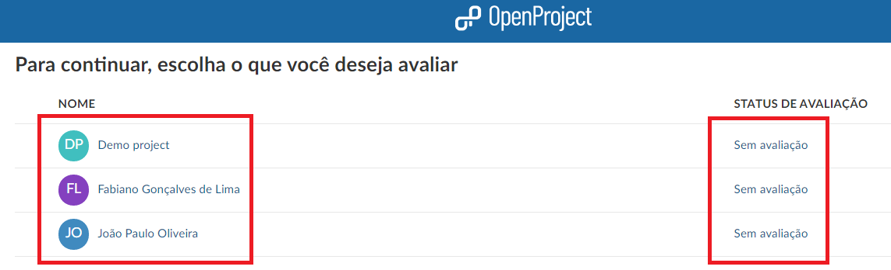
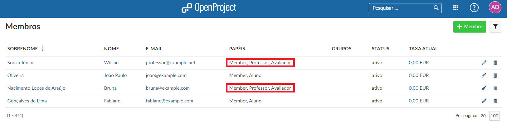

# Benchmarking & CDIO

Foi desenvolvido um plug-in para a plataforma OpenProject visando as funcionalidades propostas do trabalho.

| Tópico                                          | Conteúdo                                   |
| ----------------------------------------------- | ------------------------------------------ |
| [Explicação sobre a ferramenta](#Explicação-sobre-a-ferramenta) | O que é a ferramenta e como ela foi proposta. |
| [Adicionar o Plug-in ao projeto (**Principal**)](#Adicionar-o-Plugin-ao-projeto-método-principal) | Como adicionar e editar o plugin do Benchmarking e CDIO? |
| [Uso do modelo personalizado (**Alternativo**)](#Selecionado-o-uso-do-modelo-personalizado-métoto-alternativo) | Como usar o modelo personalizado do plugin do Benchmarking e CDIO? |
| [Usando o Plugin](#Usando-o-Plugin) | Como usar o Plugin? |
|  |  |

## Explicação sobre a ferramenta

A ferramenta Benchmarking CDIO é um instrumento concebido para avaliar projetos organizados na “Abordagem CDIO”. Esta assume a forma de um questionário, estruturado nas quatro etapas do CDIO, mediante uma abordagem de indicadores de prática e performance, composta de 16 indicadores de práticas e 12 indicadores de performances.

O questionário apresenta um sistema de pontuação baseado no modelo Benchmarking Made in Europe em intervalos que variam de 1 a 5, de acordo com a figura abaixo. Para cada indicador são descritas três situações típicas, correspondentes à prática ou à performance do projeto a ser avaliado, sendo: a) pontuação 1: 20% do nível considerado classe Best; b) pontuação 3: 60% do nível considerado classe Best; e c) pontuação 5: 100% do nível considerado classe Best. As pontuações 2 e 4 correspondem às situações intermediárias, quando o projeto apresenta práticas ou performances que supera a coluna anterior, porém não alcança o estado descrito na coluna seguinte.

As descrições das práticas e performances típicas das pontuações 1, 3 e 5 são resultado de uma expertise acadêmica trabalhada desde a década de 1980 e historicamente desenvolvida, quando um grupo de professores implantou no Curso Técnico de Eletrônica da Escola Técnica Federal de Santa Catarina a concepção de atividades acadêmicas de laboratório organizadas na forma de Projetos Integradores. A avaliação do projeto considera o estado real no momento da aplicação, garante a uniformidade da referência de pontuação e a coerência com uma realidade.

## Adicionar o Plugin ao projeto - Principal

Após a criação do projeto (sem o uso do modelo personalizado), precisamos adicionar ao projeto o plugin de avaliação **Benchmarking & CDIO**, para isso, selecionamos o menu do lado esquerdo e selecionamos **Configurações do projeto**.

Clicamos no canto esquerdo em **Módulos** e aqui podemos ver os módulos que podemos adicionar ao nosso projeto, selecionamos o módulo **Benchmarking** e clicamos no botão azul **Salvar** para adiciona-lo ao projeto.

Podemos visualizar que o módulo foi adicionado corretamente.

## Selecionando o uso do modelo personalizado - Alternativo

Se na plataforma de trabalho do OpenProject já existir algum grupo com o módulo habilitado (criado por você ou não), ao criarmos um novo projeto podemos escolher a opção de **Usar modelo**, e selecionamos o projeto cujo módulo já está adicionado, assim não precisamos configura-lo e adiciona-lo ao nosso projeto posteriormente.

## Como usar o Plugin?

Após a configuração prévia do projeto, os integrantes que fazem parte, os papeis de cada um, os grupos de trabalho, podemos usar o plugin, onde ele tem a funcionalidade de avaliação continua do grupo, podemos começar a nossa primeira avaliação. Caso ainda tenha dúvidas veja em [Configuração da equipe do projeto](benchmarking-cdio/documentação/primeiros-passos/#configuração-da-equipe-do-peojeto).

Clicando no módulo do **Benchmarking & CDIO** no menu à esquerda, vemos a nossa primeira tela inicial, onde podemos ver uma explicação rápida e resumida de como o método da avaliação funciona e um exemplo prático abaixo.
 

 
 Clicamos em **Iniciar** para começarmos as configurações iniciais.
 

Aqui vemos o que podemos avaliar, temos algumas opções de avaliação nesse projeto:
- Avaliação do grupo como um todo (todos seus participantes).
- Avaliação individual de cada aluno.

Vemos que aqui existem apenas 2 alunos a serem avaliados, pois vendo nas configurações do projeto, existem 2 professores que não podem ser avaliados mas podem avaliar e 2 alunos que podem ser avaliados mas não avaliar.

Escolhendo o avaliado, seguimos para a próxima etapa.
