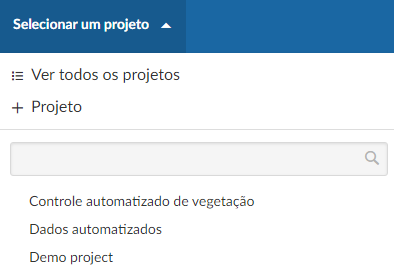
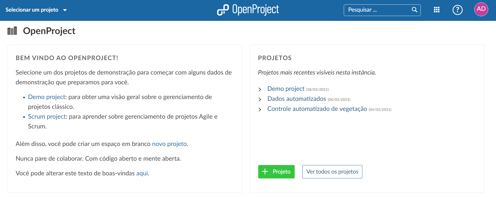
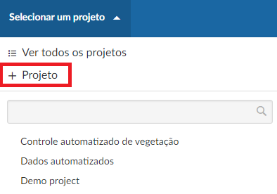
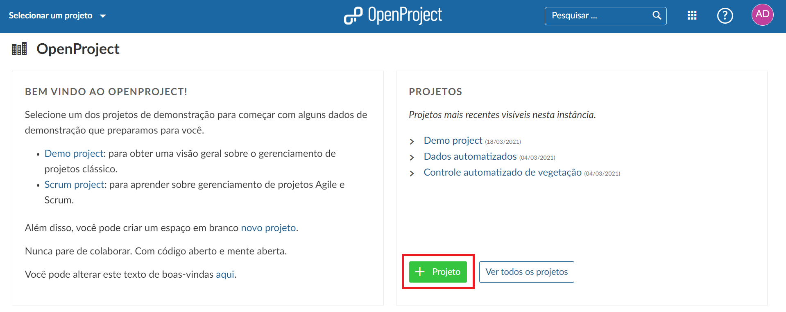
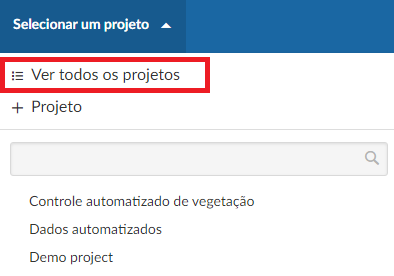
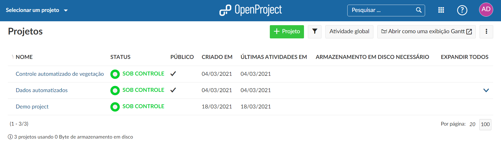

# Introdução aos Projetos

Para começar uma colaboração na plataforma OpenProject, primeiros temos que configurar um novo projeto.

| Tópico                                                  | Conteúdo                                                     |
| ------------------------------------------------------- | ------------------------------------------------------------ |
| [Abrir um projeto](#abrir-um-projeto-já-existente)      | Selecionar e abrir um projeto já existente.                  |
| [Criar um novo projeto](#criar-um-novo-projeto)         | Criar um projeto do zero ou usar um template já existente.   |
| [Ver todos os projetos](#ver-todos-os-projetos)         | Obter uma visão geral sobre seus projetos.                   |
| [Configurações avançadas](#configurações-avançadas)     | Configurações avançadas para seu projeto.                    |

<video src="https://www.openproject.org/wp-content/uploads/2020/12/OpenProject-Projects-Introduction.mp4" type="video/mp4" controls="" style="width:100%"></video> **baixar video**

## Abrir um projeto já existente

Para abrir um projeto existente, clique no botão **Selecionar um projeto** no canto superior esquerdo e selecione o projeto que deseja abrir.

Você também pode começar a digitar um nome de projeto para filtrar pelo título do projeto.

Projetos e subprojetos, são mostrados de acordo com a sua hierarquia no mesmo menu.

Além disso, você verá seus projetos mais recentes na página inicial da plataforma na seção **Projetos**. Aqui podemos simplesmente clicar em um dos projetos visíveis para abri-lo.

## Criar um novo projeto

Para criar um novo projeto, clique no botão **Selecionar um projeto** no canto superior esquerdo e selecione **+ Projeto**.

Também, você pode clicar no botão verde **+ Projeto** diretamente na tela inicial da plataforma, na seção ** Projeto **.

- Você pode criar um projeto completamente novo, criar um subprojeto de um projeto existente ou criar um subprojeto a partir de um modelo.
- Digite um **nome** para seu projeto e clique no botão azul **Criar**.
- As **Configurações avançadas** permitem configurações adicionais, como por exemplo, descrição, URL, etc.

Por padrão, a criação de um novo projeto irá definir você como administrador do projeto, independentemente de ter copiado um projeto, usado um modelo ou criado um projeto do zero. Agora você pode começar a trabalhar em seu projeto.

## Ver todos os projetos

Para ver todos os seus projetos dos quais você é membro, clique em **Ver todos os projetos** no menu suspenso **Selecionar um projeto**.

Você verá uma lista com todos os seus projetos e seus detalhes.

## Configurações avançadas

Existem informações adicionais que podem ser adicionadas ao seu projeto, como por exemplo, descrição, hierarquia do projeto, visibilidade, restrições, poderes, etc.
